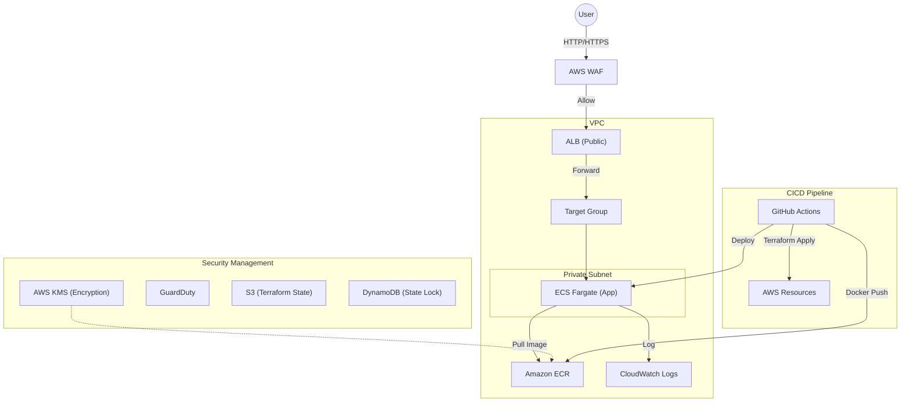

# AWS Fargate & Terraform Portfolio

TerraformとGitHub Actionsを使用した、セキュアでモダンなAWSコンテナ構築のポートフォリオです。
インフラのコード管理(IaC)から、アプリケーションの自動デプロイ(CI/CD)、およびセキュリティベストプラクティスの実装までをワンストップで構築しています。


## 🏗 アーキテクチャ構成図



## 🛠 技術スタック

| カテゴリ | 技術・サービス | 詳細 |
| :--- | :--- | :--- |
| **Compute** | Amazon ECS (Fargate) | サーバーレスコンテナ基盤 |
| **Network** | VPC, ALB, NAT Gateway | マルチAZ構成 (ap-northeast-1a/1c) |
| **IaC** | Terraform | S3 Backend + DynamoDB Lock によるState管理 |
| **CI/CD** | GitHub Actions | インフラ構築とアプリデプロイの完全自動化 |
| **App** | Python (Flask), Docker | 軽量Webアプリケーション |
| **Security** | AWS WAF | AWS Managed Rules (Common, SQLi) |
| **Security** | Security Group | Chaining (参照許可) による最小権限の実装 |
| **Security** | AWS KMS | Customer Managed Key (CMK) によるECR暗号化 |
| **Monitoring** | GuardDuty, Access Analyzer | 脅威検知と設定監査 |

## 🔐 セキュリティ実装のポイント

クラウドセキュリティエンジニアを目指す観点から、以下の対策をコードベースで実装しています。

1.  **多層防御 (Defense in Depth)**
    *   **WAF:** アプリケーション層での攻撃（SQLインジェクション等）をブロック。
    *   **Security Group:** インバウンドルールをIP直接指定ではなく、SG ID参照（ALBからの通信のみ許可）に限定し、攻撃面を縮小。
    *   **Private Subnet:** アプリケーション(ECS)をプライベート領域に配置し、インターネットからの直接アクセスを遮断。

2.  **データ保護 & 監査**
    *   **KMS暗号化:** AWS管理キーではなく、CMK（カスタマー管理キー）を作成し、ECRのリポジトリを暗号化。キーローテーションも有効化。
    *   **GuardDuty / Access Analyzer:** 予期せぬ脅威や意図しない公開設定を検知する仕組みをTerraformで有効化。

3.  **DevSecOps**
    *   インフラ変更とセキュリティ設定（WAFルール等）をコード管理し、PRベースでのレビュー・監査を可能にしています。

## 🚀 デプロイフロー

GitHub Flowに基づき、`main` ブランチへのマージをトリガーに自動デプロイが実行されます。

1.  **Build:** Dockerイメージのビルド
2.  **Test:** Terraform Format/Validate チェック
3.  **Infrastructure:** `terraform apply` によるAWSリソースの更新
4.  **Push:** ECRへのイメージプッシュ（KMS暗号化済）
5.  **Deploy:** ECSタスク定義の更新とサービスのローリングアップデート

## 📂 ディレクトリ構成

```text
.
├── .github/workflows/   # CI/CD設定 (GitHub Actions)
├── app/                 # アプリケーションコード (Python/Dockerfile)
├── vpc.tf               # ネットワーク定義 (VPC, Subnet, IGW, NAT)
├── ecs.tf               # コンテナ基盤定義 (Cluster, Service, Task)
├── alb.tf               # ロードバランサー定義
├── waf.tf               # WAF設定
├── sg.tf                # セキュリティグループ定義
├── kms.tf               # 暗号化キー定義
├── provider.tf          # Terraform設定 (S3 Backend)
└── README.md            # 本ドキュメント
